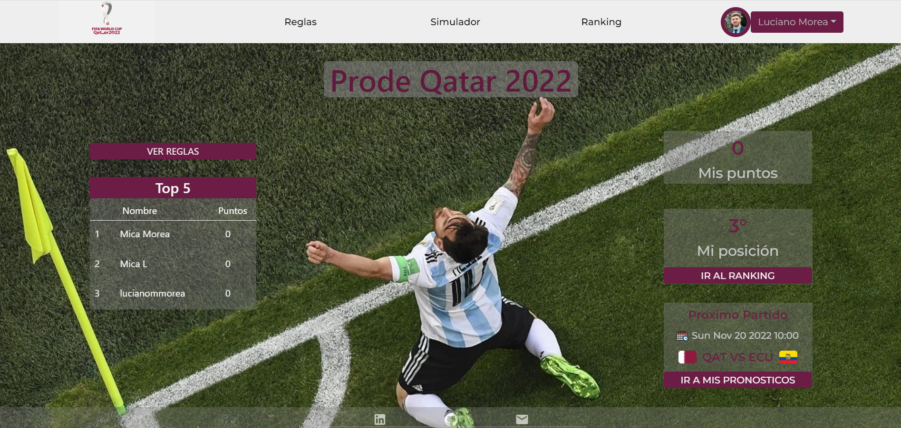
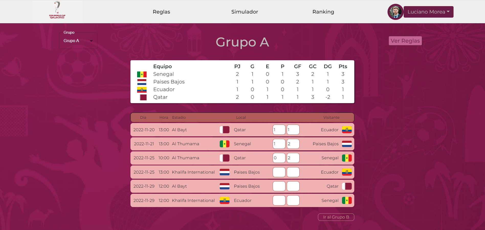
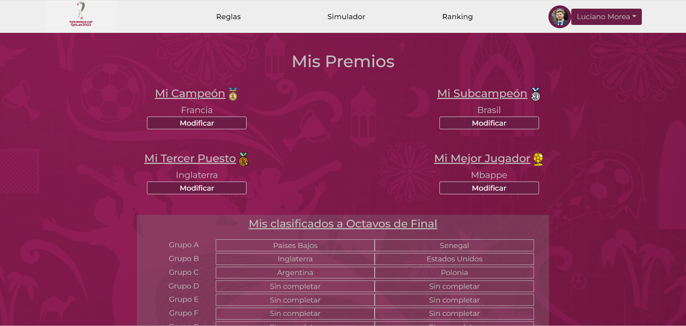
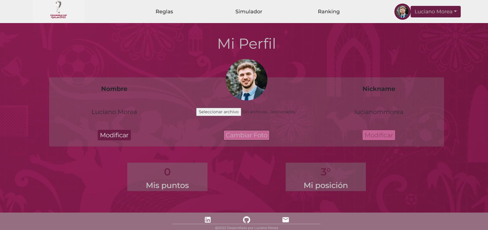
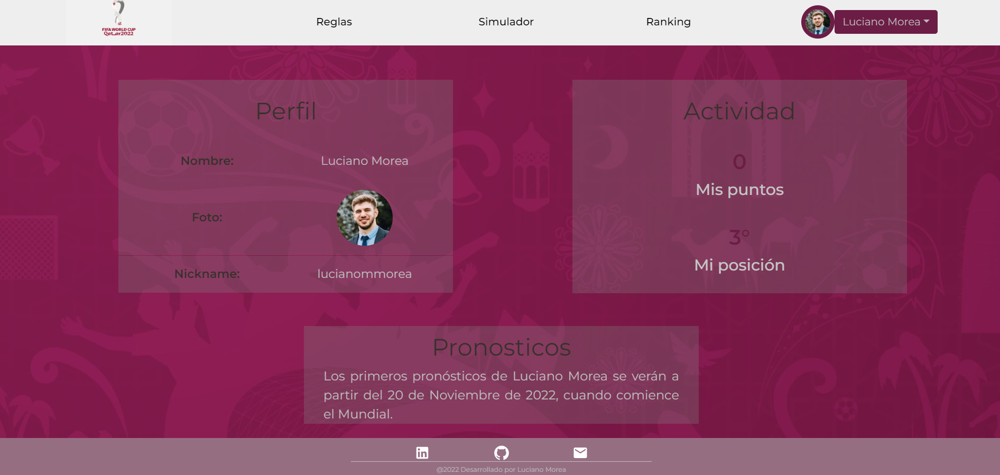

# Prode Mundial Qatar 2022

<!--  -->

<!--  -->

## Introducción

Prode Mundial Qatar 2022 es un proyecto para simular resultados del Mundial Qatar 2022, y cargar Pronósticos de Resultados. 

## Descripción

El proyecto, consiste en una SPA (Single Page Application) para simular resultados del Mundial Qatar 2022, y poder crear Pronósticos tanto de resultados de los partidos como de Campeón, Subcampeón, Tercer Puesto y Mejor Jugador, que obtendrán puntajes en base a los resultados que se darán en el Mundial. Dispone de un ranking, panel de configuración de Usuario y página por usuario. Se ingresa a través de una Landing Page, que posee una Card que muestra el Top 5 del Ranking de Usuarios, y una Card con el próximo partido a disputarse del Mundial. Una vez logueado a través de Auth0, en la misma Landing Page, se podrá visualizar los puntos del Usuario, y su posición en el Ranking. En la barra superior, se encuentran Links a las Reglas y Sumatoria de Puntos, a un Simulador de Resultados (que no quedan guardados), y al Ranking general. Con un desplegable por cada Usuario, se podrá ir a la sección de Mis Pronosticos (cuyos resultados cargados si quedan guardados), a la sección de Mis Premios, donde se podrá elegir el Campeón, Subcampeón, Tercer Puesto y Mejor Jugador pronosticado por el usuario, y a la sección de Configuración, donde se podrá cambiar tanto el nombre, como el nickname y la foto de usuario. También se podrá acceder a un perfil de cada Usuario, donde se visualizarán sus datos básicos, y sus pronósticos de Resultados, una vez que ya no esté habilitada su modificación. Los Administradores, poseen además secciones para cargar los verdaderos resultados, y la posibilidad de Banear y designar nuevos administradores.

## Tecnologías

### Front End:
HTML, CSS, Javascript, React, Redux, Material UI, Bootstrap

### Back End:
Node.js, Express, Sequelize.

### Database:
PostgreSQL.

  &nbsp;
  &nbsp;
  &nbsp;
  &nbsp;
  &nbsp;
  

  &nbsp;
  &nbsp;
  &nbsp;
  &nbsp;
  
  &nbsp;

## El sitio se encuentra actualmente disponible en : https://prodeqatar.vercel.app/

Visítalo! 

